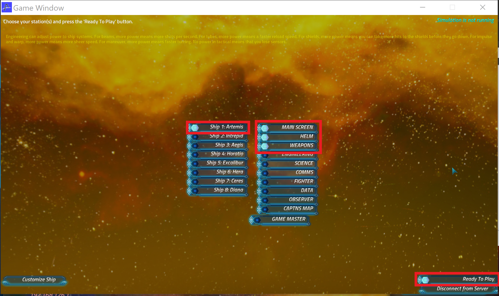

# Artemis Workshop 🚀

### 1. Setup TCP Proxy
The TCP Proxy is automatically configured to listen on the Artemis port (2010) and forward to the server's 2010 port. You will need to find your Client IP using either ```ipconfig``` (Windows) or ```ifconfig``` (Linux). 
```cmd
Wireless LAN adapter WiFi:

   Connection-specific DNS Suffix  . : Home
   IPv4 Address. . . . . . . . . . . : XXX.XXX.XXX.XXX
```
Now open Terminal (Command Prompt) and copy and paste the commands below. The server host will share their IP address.
```cmd
git clone https://github.com/rohlex18/ArtemisWorkshop
cd ArtemisWorkshop
pip install -r requirements.txt
python main.py --src <YourIP> --dst <ServerIP>
```
Do not include the `<>`. You should see:
```
Starting TCP proxy... press ctrl+C to exit... right-click to copy!
```

### 2. Setup Artemis Client
[Visit this link](https://universityofadelaide.box.com/s/ywlggscc58hpwc7ekq3kpr0327fbswvz) and download the Artemis executable. Follow the install prompts and accept the firewall configuration options. Pick the **800x600 windowed** resolution so that there is room on your screen to also show the TCP Proxy. Double check the version is `2.7.5`. Now, click `Start Client`.


**Do not supply the server address**. Instead enter your IP address `XXX.XXX.XXX.XXX` and once the server is available and your TCP Proxy is ready (Step 1), click `Connect to Server`.


Select your ship! If Artemis is full, you may have to select a different one. Select your role! `Main Screen` must be selected by someone for the ship to enter the game - this is meant for the ship's captain to coordinate the bridge - this role has **no controls**. Each role is only available for one client per ship - so don't take all the roles!  `Helm` and `Weapons` are the easiest to get started.
For the other roles, I suggest [reading the Wiki](https://artemissbs.fandom.com/wiki/ArtemisSBS_Wikia) for instructions. To join the game, click `Ready To Play`.



Now go forth and conquer!

### 3. Understanding the Packet Structure

If you succeeded with steps 1 and 2, the TCPproxy terminal should be showing:
```
Starting TCP proxy... press ctrl+C to exit
2023-08-15 20:05:18.824922: client --> deadbeef:0000001c:00000002:00000000:00000008:4c821d3c:00000024
2023-08-15 20:05:20.731528: client --> deadbeef:00000020:00000002:00000000:0000000c:4c821d3c:0000001a:00000000
2023-08-15 20:05:21.829783: client --> deadbeef:0000001c:00000002:00000000:00000008:4c821d3c:00000024
```

Start exploring the game and watch how actions (mouse clicks) you take produce packets in the console. For convenience they are printed in 4-byte groupings that represent **fields**. As different packets are produced can you guess what each packet means? why is the first one always ```deadbeef```? How are the 2nd and 5th fields related (hint: convert the values to decimal)?

Notice that `deadbeef:0000001c:00000002:00000000:00000008:4c821d3c:00000024` keeps appearing even when you don't click any actions. What is this packet? Filter it out using the code below.


### 4. Sending Packets 

Now we are ready to use the keyboard to send our own Artemis packets! In the ```artemis-workshop``` folder we will only be editing the ```pwn_client.py``` file. I've set it up so any legitimate edits to this file can be instantly seen on the TCP server, but if you have a syntax error or accidently click ```ctrl-C``` then you will have to rerun ```main.py``` and reconnect your Artemis client.


### 5. Manipulating Packets

In this section we will be a bit more covert and instead of using the keyboard to send packets, we will edit packets as they are sent from the client.

## Acknowledgements
I'ld like to thank the Artemis creator, Thom Robertson, for his dedication to releasing updated game versions. Please support Thom's work by purchasing the [bridge license](https://www.artemisspaceshipbridge.com/store/p1/Artemis_Spaceship_Bridge_Simulator_2.html#/) or [steam license](https://store.steampowered.com/app/247350/Artemis_Spaceship_Bridge_Simulator/). I'ld also like to thank the Artemis community for providing [comprehensive protocol documentation](https://artemis-nerds.github.io/protocol-docs/).
